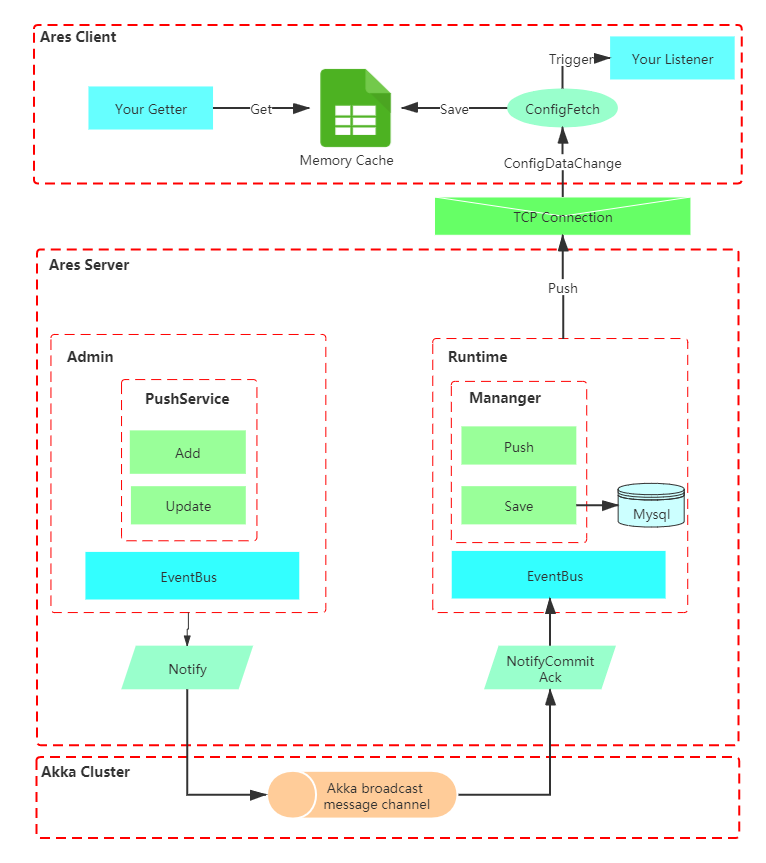

Open source dynamic configuration center with easy deployment and high stability

--------------------------------------------------------------------------------
# What is ARES?
 
 Welcome to use Ares dynamic configuration system.
 The Ares system is developed based on the Java language, a dynamic configuration system with simple deployment and high stability.
 It allows you to centrally and dynamically manage the configuration in your application and also it allows your application to quickly change the runtime application configuration in a combination of monitoring and pulling.It has a rich configuration management UI to simplify operations, while also ensuring data isolation and flexibility.
 
 
 
## Overall architecture

  
 
-------------------------------------------------------------------------------- 
# Features

## Efficient dynamic configuration

* Multi-environment and multi-level configuration management to support complex business scenarios and network environments

* Support websocket mode to facilitate access to non-Java languages

* Adaptive load balancing on the client side to avoid configuration loss caused by server jitter

* Based on TCP persistent connection, the monitoring mode makes the configuration take effect in a more real-time manner.

## Scalable cluster service

* The server of distributed deployment forms a cluster through remote coordination

* Decentralized cluster service, each server has the same external service.

* The server clustering process does not depend on other middleware

* It allows the runtime to expand the server cluster.

* Unified deployment of server side and management side, no additional deployment of SLB is required
   
--------------------------------------------------------------------------------  

# Modules

* ares-biz : The core logic module includes the main configuration management and push processes.

* ares-client : The client SDK module is responsible for communicating with the server cluster and updating the configuration.

* ares-client-spring : It is a fast access to SDK based on Spring framework.

* ares-cluster : It is a decentralized cluster module based on Akka framework.

* ares-common : It contains a collection of commonly used tool classes and major basic data models

* ares-dao : Database access layer

* ares-deploy : Build and deploy programs to protect configuration files

* ares-model : Data model set

* ares-webapi : Interface logic module

--------------------------------------------------------------------------------   

# UserGuides

 [QuickStart](doc/UserGuide/QuickStart.md) 
  
 [Deployment](doc/UserGuide/Deployment.md)
 
 [Manual](doc/UserGuide/Manual.md)

 --------------------------------------------------------------------------------   

# Design
 [Architecture](doc/DesignAndPattern/Architecture.md)
 
 [Server](doc/DesignAndPattern/Server.md)

 [Client](doc/DesignAndPattern/Server.md)

 [Flow](doc/DesignAndPattern/Flow.md)

--------------------------------------------------------------------------------   

# Performance and restrictions

Our testing environment:

1 server / 50 clients

server specification: 2c4g, JVM -Xmx512m

<table>
  <thead>
    <th>CilentsNumber</th>
    <th>StartPushingTime</th>
    <th>LastReceivedTime</th>
    <th>ElapsedTime</th>
    <th>Failure</th>
  </thead>
  <tbody>
    <tr>
      <td>10</td>
      <td>10:34:15.400</td>
      <td>10:34:15.482</td>
      <td>82ms</td>
      <td>0</td>
    </tr>
    <tr>
      <td>20</td>
      <td>10:39:51.080</td>
      <td>10:39:51.183</td>
      <td>103ms</td>
      <td>0</td>
    </tr>
    <tr>
      <td>50</td>
      <td>10:58:32.301</td>
      <td>10:58:32.490</td>
      <td>190ms</td>
      <td>0</td>
    </tr>
  </tbody>
</table>

--------------------------------------------------------------------------------   

# About

The Ares system is currently in use within the Chengying company and provides stable services:

* Stable operation for a long time：It has been in stable operation for more than 1 year since it was launched.

* Support multiple lines of business：Three environment-isolated business lines in the company use 1 sets of Ares dynamic configuration at the same time.

* Access to many services：A total of 23 online services are supported, including more than 600 pieces of configuration information

* Support for multiple environments：It supports four sets of environments, such as development environment, test environment, pre-release environment and online environment at the same time.

* Complete a large number of configuration push：It has made nearly 2000 configuration changes since it was launched.
   
--------------------------------------------------------------------------------   

# Planning

* Grayscale release：It allows the configuration to take effect according to the traffic identification or machine IP, thus making the configuration effective process more smoothly.

* Smooth expansion：After new machines join the cluster, clients can quickly perceive and load balance.

* Support for spring annotations：It supports dynamic modification of configuration items for spring annotations

* Support for multiple development languages：In the future, more development languages SDK will access Ares by means of websocket or TCP.

* Cloud native deployment：By optimizing the way the cluster is established, it supports deployment in environments such as K8S

* Extensible management-side permissions：The user can connect his or her own authority system to the management end.

--------------------------------------------------------------------------------  
# Support  

## IM communication
 

## Community communication
 
 preparing...
 
## Expert sharing
preparing...

--------------------------------------------------------------------------------  
# Team  
<table>
  <thead>
    <th>Avater</th>
    <th>Github Account</th>
    <th>Company</th>
    <th>Role</th>
    <th>Email</th>
  </thead>
  <tbody>
    <tr>
      <td width='20%'></td>
      <td>kaneback</td>
      <td>ChengYing</td>
      <td>Maintainer</td>
      <td>kaneback@163.com</td>
    </tr>
  </tbody>
</table>
  
 
