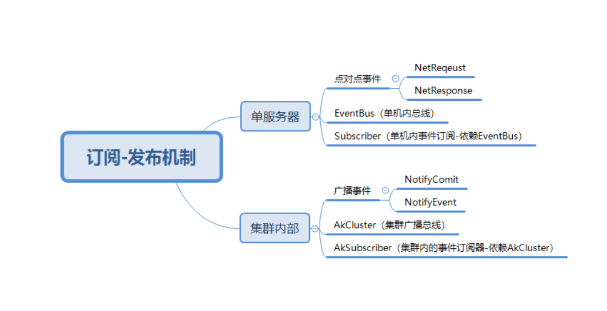
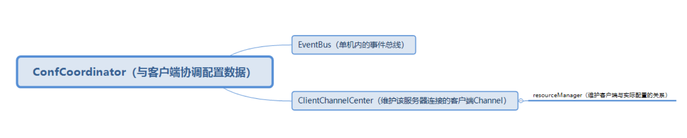

# Ares中的发布订阅机制
## 万物皆事件
在Ares系统中，biz的service模块以下的实现都是基于事件驱动，也就是有“事件”“、”发布者”、“订阅者”，三个主要元素构成调用

所有的事件类，多数基类为MEvent

事件的发布者和订阅，又可以主要分成两种：数据通讯和集群协调

## 分类的事件处理实现

## 客户端通讯事件

## 数据同步事件

## 核心组件描述

* 从图中可以看出Ares服务端使用了Netty与客户端进行通信，基于Netty的长连接实现与客户端的通信，能够保证配置的变更能够快速通知到客户端。服务端之间则基于Akka Cluster和2PC实现了的服务端之间的一致性。
* NettyServer: 通过netty创建server, 接受客户端的channel链接和数据接受发送;
* Coordinator: 当NettyServer接受到请求时，通过coordinator进行处理, 同时coordinator订阅eventbus的事件 ; 当server端配置变更时，需要主动推送数据，会通过eventbus 传递给coordinator;
* ConfManager: 配置管理的核心类，响应配置的查找、变更;
* ServerCluster: 集群服务管理入口的类; 提供配置变更在集群内的publish;
* ClusterNotify：集群内消息通知的类， 底层实现可以是AkkaCluster，也可以是自定义其它方式;
* AkkaCluster: 通过akka 实现集群管理和消息的publish;
* Cache: 用于配置的缓存, 加快配置的查找和读取;
