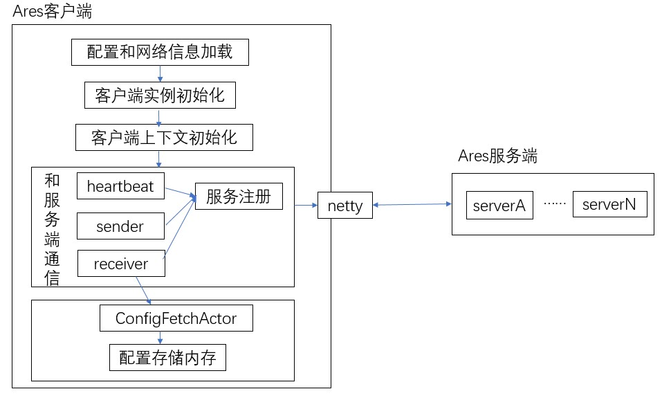
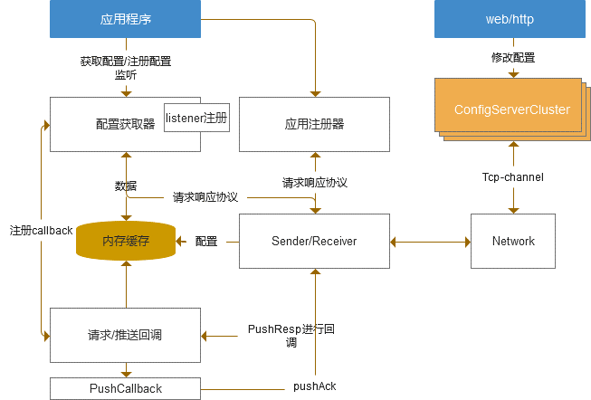
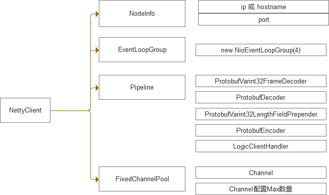
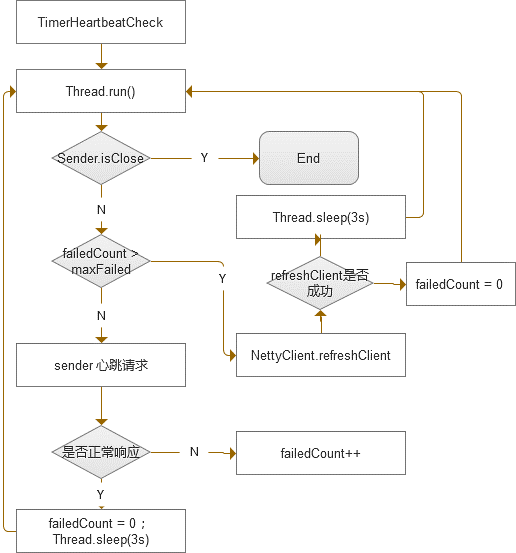

# 客户端技术设计说明文档

## 客户端整体内部执行图

### 流程概述

* 客户端启动后spring env加载本地配置和网络信息
* 客户端实例ClientInstanceInfo初始化
* 客户端上下文SpcpContext初始化
* 客户端和服务端进行通信前准备以及进行通信：保持心跳、sender注册和消息发送、receiver注册和消息接收
* 客户端获取服务端的变更配置：通过ConfigFetchActor获取配置，并将配置存储到内存中

## 客户端核心流程

### 原理说明

* 应用注册： 应用程序启动时，获取此应用程序的基本信息(appcode、envcode等信息)，生成唯一client instanceId进行应用注册, 服务端保留 channel 、client instanceId 、appcode的映射关系
* 配置获取：应用程序可以主动获取某个dataId配置项的内容，默认是查找缓存，如果没有在发送网络请求到服务端查找
* 配置监听: 每次配置项的变更都会推送到客户端，默认根据应用程序的基本信息，进行该应用下所有配置的监听；其中应用程序可以指定对部分dataId进行自定义监听器的回调;  默认监听器是LogListener,只打印日志
* 推送回调：服务端发生变更, 主动推送变更项数据给client，client调用预先注册的callback，进行缓存的刷新，dataId 自定义/默认listener的回调
* 缓存更新：缓存更新根据 dataId 确定唯一的一项配置，根据modifyTime判断是否更新

## 网络&协议层

* 通信采用netty作为底层框架

### 网络通信设计

具体说明
* NodeInfo:  目标服务端的address信息
* EventLoopGroup: netty socket select和pipeline执行管理
* Pipeline: 输入输出和channel事件的处理, proto部分进行半包粘包处理 , LogicClientHandler: 是自定义数据处理
* FixedChannelPool: netty自带的通道池, 如果某个channel失效，默认取下一个channel提供给上层，并重新初始化失效的通道

## Sender、Receiver设计

### 原理说明

* 协议: NetReqest NetResponse 是通信协议基本的信息封装，FetchReq 等是功能层自带自定义属性的请求 ，FetchResp类似, 是上层功能自定义的返回数据属性
* Sender: 发送器主要是 对nettyclient的调用、请求转换为Proto格式的Event, 当前请求都有一个唯一的请求id即EventId；并且到 Receiver进行登记，可以同时附带一个callback，用于返回响应后的回调
* Receiver: 接收器， 每个请求发送之后，都会注册到Receiver, 等net返回响应[附带请求的eventId]之后，根据eventid进行匹配，找到对应的 ReceiverFuture, 如果存在callback ,则会调用 RespAcotr(内置线程池)进行task 执行

## 心跳设计

### 原理说明

* 启动一个线程，循环间隔一定时间发送心跳请求，如果响应失败，且连续失败3次则认为当前的NettyClient失效，选择下一个servernode作为address，重新创建一个新的nettyClient ；如果重新创建NettyClient失败达到最大次数, 则sleep N秒，下次再重新创建， 如果Sender已经close， 则停止心跳线程
