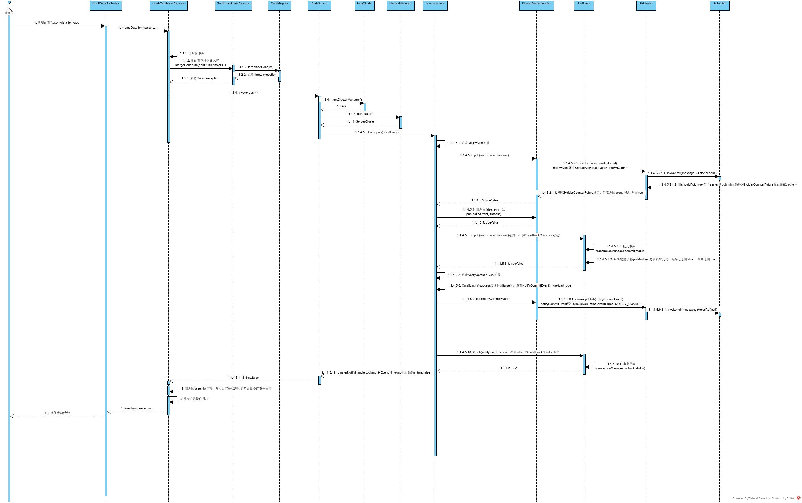
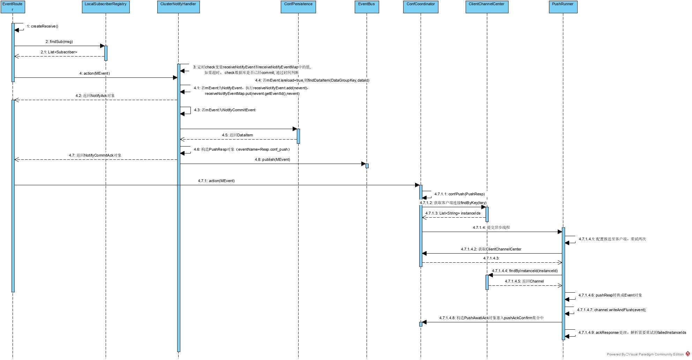

# 配置变化同步流程

# 客户端启动流程

* 页面WEB通过接口调用一台Ares服务器，对配置进行更新，对应逻辑为PushService.publish

* publish的调用被转换为NotifyEvent，即配置推送事件，此事件会被发送到集群中所有server中，同时开启DataSourceTransactionManager事务管理

* 所有server在收到NotifyEvent会有确认响应

* 1.进行publish的server在收到NotifyEvemt异常时，会发起重试（重试1次），重试仍失败，则进行事务回滚，配置变更失败

* 2 NotifyEvemt发布并确认完成，事务提交，进行publish的server执行配置信息持久化；同时发布集群广播事件NotifyCommitEvent（）

* NotifyCommitEvent配置信息是否需要重新加载设置：数据库中最新的dataId对应的GmtModified！=commit时的GmtModified，说明commit之后，数据库又被覆盖了。需重新加载最新数据

* 各个收到NotifyCommitEvent的server会将该配置推送到与自己相连接的客户端上（含进行publish 的server）

* 1.外部应用启动时，初始化SpringAresContextCreater 对象，对象内部会进行如下初始化操作：

组装创建SpcpContext对象->注册事件回调ProtocolCenter.registe(Resp.conf_push, new PushCallback())->ConfigFetchActor.trigger(PushResp resp)(ack响应channel.writeAndFlush(event) & 更新缓存 & 匹配配置对应的listener,触发listener.receive(DataItem item))

* 2.外部业务应用注册dataId的监听ConfigFetchActor.addListener(String dataId, Listener listener)

* 3.变量初始赋值ConfigFetchActor.getConfig(String dataId) (优先从缓存获取，缓存没有再fetch->channel.writeAndFlush(event) ?)

# 业务方配置实时获取
通过调用ConfigFetchActor.getConfig(String dataId) 获取配置信息(优先从缓存获取，缓存没有再fetch返回并更新缓存)

# 服务端同步过程

-------------集群订阅 NotifyCommitEvent------------------------
EventRouter.createReceive()
->ClusterNotifyHandler.action(mEvent) (NotifyCommitEvent.isReload->获取最新的DataItem)

PushResp rp = new PushResp();
rp.setEventId(eventId);
rp.getItems().add(item);
DataGroupKey dgk = item.groupKey();
DataClusterKey dataClusterKey = item.clusterKey();
rp.setDataCluster(dataClusterKey);
rp.setDataGroup(dgk);
MEvent me = new MEvent(Resp.conf_push, rp);
->eventBus.publish(me)->ActorRef.tell(event, ActorRef.noSender())

->EventRouter.createReceive()→ConfCoordinator.action(mEvent)

->ConfCoordinator.confPush(PushResp)->Channel.writeAndFlush(MessageConvert.toEvent(pushResp));

一致性保障
集群信息同步确认增加事务控制，未全部成功则事务回滚，本次配置更新失败；

配置信息在集群中同步更新时前，如数据库中的配置信息与提交时不符， 会拉取数据库中最新的数据；
