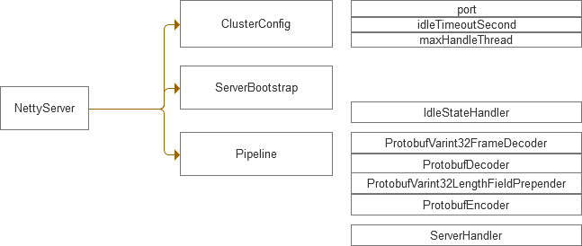
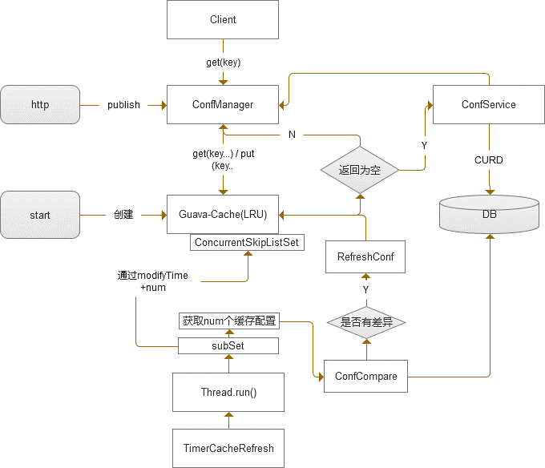
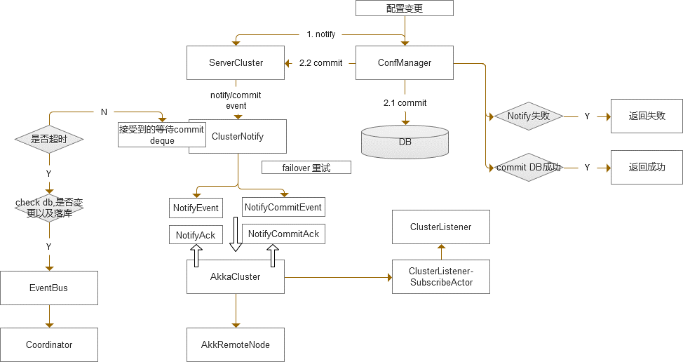

# 服务端核心流程

* NettyServer: 通过netty创建server, 接受客户端的channel链接和数据接受发送;

* Coordinator: 当NettyServer接受到请求时，通过coordinator进行处理, 同时coordinator订阅eventbus的事件 ; 当server端配置变更时，需要主动推送数据，会通过eventbus 传递给coordinator;

* ConfManager: 配置管理的核心类，响应配置的查找、变更;

* ServerCluster: 集群服务管理入口的类; 提供配置变更在集群内的publish;

* ClusterNotify：集群内消息通知的类， 底层实现可以是AkkaCluster，也可以是自定义其它方式;

* AkkaCluster: 通过akka 实现集群管理和消息的publish;

* Cache:  用于配置的缓存, 加快配置的查找和读取;

--------------------------------------------------------------------------------

# 网络层设计

* ClusterConfig:  服务器启动相关配置, 例如：端口 空闲超时设置等

* Pipeline: 输入输出和channel事件的处理, proto部分进行半包粘包处理 , ServerHandler: 是自定义数据处理;  IdleStateHandler 用于处理空闲的 channel, ServerHandler 可以响应 channel状态的变化;

--------------------------------------------------------------------------------

# 缓存设计

* 缓存的目标是加速key的查找和读取，减小数据库的IO压力

* 缓存采用guava-cache作为内存缓存;

* 由于DB中数据量会不断增长，且缓存内容无热点, 所有dataId都会随时被修改; 所以cache初始化并不加载任何内容；采用LUR算法进行cache;

* 缓存更新事件：client读取，当cache未命中时会加载 ;
http publish新的配置变更时，cache会被刷新 ;
定时任务刷新key时，db与cache有差异时，(即缓存不是最新的) 则会刷新cache;

* 缓存更新:  通过key & 配置的modifyTime 比较，cache存放最新的内容;

--------------------------------------------------------------------------------

# 数据一致性
场景:有多台服务器，不同的client实例会随机连接一个服务实例，此时服务端上配置变更，需要同步给所有server实例，每个server实例推送到对应的client实例上；

期望：配置变更时需要保证服务端之间数据一致，同时客户端能实时响应最新的数据;
但是由于网络不稳定，以及服务重启操作等因素，服务端sever之间，以及客户端上的数据不一定能保证是实时最新的; 需要通过数据同步机制保证任何情况下数据的一致性;

## 服务端数据同步

### 通过网络进行数据同步

AkkaCluster 底层通过gossip协议+netty进行集群的管理，程序通过ClusterListener监听cluster上node的变化;
Akka cluster通过相关配置，进行publish和node[up remove…]监听控制;

* 上层配置管理(ConfManager)，首先进行notify事件的通知，表示有一个配置变更事件
* clusterNotify pub事件并且确认所有server返回ack[1]之后，
* ConfManager把数据commit到数据库，commit成功之后发送, clusterNotify pub commit事件,
* ClusterNotify接受commit ack[2];
* 其它server中的clusterNotify接受到pub的NotifyEvent， 把事件加入到待commit的deque中，等待commitEvent; 如果超时未接收到，则通过notifyEvent 与 db进行check是否变更已经落库;
* 如果落库，则推送事件到客户端 & 刷新cache；如果没有，则丢弃;
* 如果接受NotifyCommitEvent时，内存中未找到对应的NotifyEvent, 依旧推送事件到客户端 & 刷新cache ;
Ack[1] 是必须返回，且ack数量必须和集群数量一致
Ack[2] 非必须返回，超时不返回仅打印日志;

### 通过定时任务进行cache的刷新

详见: 动态监听 -> 服务端核心流程设计
