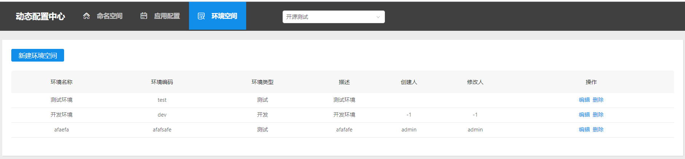

## 运维管理
### 配置管理的五大核心概念
**应用**: 实际使用配置的应用, 每个应用都需要有唯一的身份标识 —— appCode  
**环境**: 配置对应的环境 , 环境和代码无关，同一份代码部署在不同的环境就应该能够获取到不同环境的配置。  
**集群**: 一个应用下不同实例的分组 ; 对不同的cluster，同一个配置可以有不一样的值，如zookeeper地址  
**配置组**: 一个应用下不同配置的分组, 如数据库配置文件，RPC配置文件，应用自身的配置文件等  
**配置项**: KV配置对的内容; key使用dataId进行表示; Value即配置的Content
#### 关系如下图所示

### 配置管理
#### 命名空间
命名空间（namespace）的主要作用是为了更清楚的将不同业务线的应用做划分，方便我们管理不同业务线的各个应用。命名空间页面主要提供对命名空间的管理功能，包括：新建命名空间，删除命名空间，命名空间列表。 如下图所示：

#### 新建命名空间
新建命名空间需要填写：命名空间编码，命名空间名称，描述三个字段。具体如下图所示。

#### 环境空间
环境空间的主要作用是划分应用不同的部署环境，应用与环境是一对多的关系，即同一个应用在不同环境下，可以有不同的配置。目前定义了：开发，测试，预发，生产四个环境。
具体界面如下所示：

### 应用配置
应用配置主页面主要是对已有应用的展示，并提供了新建应用，删除应用，应用搜索功能。

#### 应用配置页面
点击应用配置主页面中的应用名称，会进入应用配置页面，我们对应用配置的设置都会在这里完成。新增一个应用配置主要有以下几个步骤。  
1、首先检查左侧菜单栏中，该应用是否已经绑定环境。如果没有绑定环境，则通过“绑定环境”按钮来绑定环境，如果已经绑定环境，则选择要新增配置的环境。  
2、选择要新增配置的分组，默认为default分组，如果对分组有需要，可以通过“新增分组”来完成分组的创建  
3、选择好分组之后，我们就可以创建新的应用配置了。ares中对于value提供了丰富的类型，能够满足我们开发过程中的不同需求，主要有：TEXT
JSON，XML，YAML，HTML，Properties。  
4、保存完配置之后，可以通过配置列表中右侧“push轨迹”查看已经接收配置的应用实例，描述或配置内容的改变都会触发push操作。

