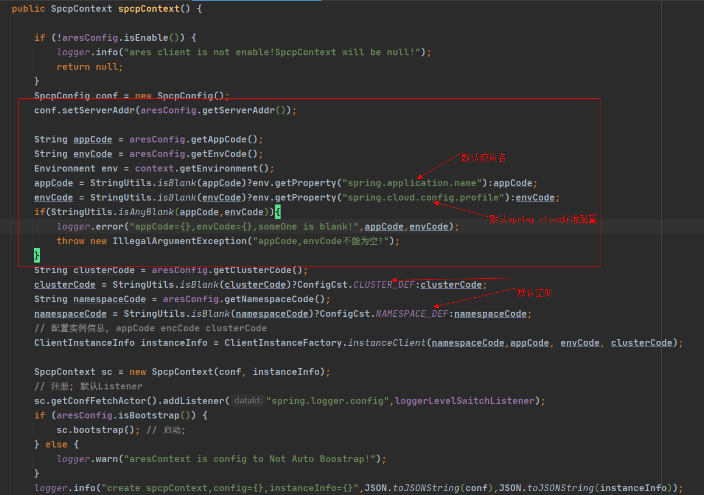

# 说明：

# 本案例基于spring boot 2.X 

## 关键操作步骤
## 1. 搭建spring boot 2.X项目，引入关键依赖
```xml
 <dependency>
    <groupId>org.springframework.boot</groupId>
    <artifactId>spring-boot-starter-web</artifactId>
    <version>2.1.1.RELEASE</version>
</dependency>

```
## 2. 添加 spring ares client，具体版本以最新为主
```xml
 <dependency>
    <groupId>com.cy.ares</groupId>
    <artifactId>ares-client-spring</artifactId>
    <version>${ares-client-spring.version}</version>
</dependency>
```
## 3. 根据实际需要，添加其它依赖包
## 4. 主程序配置，添加自动扫描 ares client包，注入bean
```java
@SpringBootConfiguration
@EnableAutoConfiguration
@ComponentScan(basePackages = "com.cy.ares")
```
## 5. 添加关键配置，具体配置根据实际环境配置
```properties
#应用端口
server.port=30000
#应用名
spring.application.name=ares_demo
#动态配置应用名
ares.config.appCode=test
#动态配置环境编码
ares.config.envCode=cy-platform-dev
#动态配置项目空间名
ares.config.namespaceCode=fd_saas
#动态配置服务节点ip：port 多个逗号分隔
ares.config.serverAddr=192.168.101.32:30333

```
**对应关键配置作用**


## 6. 添加动态配置管理类,加载动态配置核心bean SpcpContext;详细可参照本项目AresConfig类

```java
@Component
public class AresConfig {
    private static final Logger LOGGER = LoggerFactory.getLogger(AresConfig.class);
private static final String TEST_PUSH_ACTION_CFG_KEY = "test.push.cfg.key";
    private static final String TEST_GET_ACTION_CFG_KEY = "test.get.action.cfg.key";
    @Resource
    private SpcpContext spcpContext;
}
```

**支持两种方式，一种是配置变更监听器通知更新，一种是主动获取最新配置。**

### 方式1：配置变更监听器通知更新
```java
 /**
     * 测试配置
     */
    @Getter
    private List<String> testPushActionCfg = Collections.emptyList();

    @PostConstruct
    public void init() {
        ConfigFetchActor fetchActor = spcpContext.getConfFetchActor();

        try {
            fetchActor.addListener(TEST_PUSH_ACTION_CFG_KEY, this::setTestPushActionCfg);
            setTestPushActionCfg(spcpContext.getConfFetchActor().getConfig(TEST_PUSH_ACTION_CFG_KEY));
        } catch (Exception e) {
            LOGGER.error("AresConfig fetchActor riskFilterTenantCodes config fail. e:{}", e);
        }
    }

    /**
     * 更新本地配置
     *
     * @param dataItem
     */
    private void setTestPushActionCfg(DataItem dataItem) {
        String value = dataItem != null ? dataItem.getContent() : null;
        // 配置变更打印
        LOGGER.warn("setSpecialTenantCodesConfig value={}", value);
        if (org.apache.commons.lang3.StringUtils.isBlank(value)) {
            testPushActionCfg = Collections.emptyList();
        } else {
            try {
                testPushActionCfg = JSONObject.parseObject(value, new TypeReference<List<String>>() {});
            } catch (Exception e) {
                LOGGER.error("parse fail e:{}", e);
                testPushActionCfg = Collections.emptyList();
            }
        }
    }
```
### 方式2：主动获取最新配置
```java
/**
     * 根据key查询value
     *
     * @param key 配置key
     * @return 配置value
     */
    private String getValue(String key) {
        try {
            ConfigFetchActor fetchActor = spcpContext.getConfFetchActor();
            DataItem dataItem = fetchActor.getConfig(key);
            if (dataItem == null) {
                return null;
            }
            return dataItem.getContent();
        } catch (Exception e) {
            LOGGER.error("get ares config exception!key:" + key, e);
        }
        return null;
    }

    /**
     * 根据key查询value
     *
     * @param key        配置key
     * @param defaultVal 默认值
     * @return 配置value
     */
    public String getValue(String key, String defaultVal) {
        try {
            String configValue = getValue(key);
            if (StringUtils.isBlank(configValue)) {
                return defaultVal;
            }
            return configValue;
        } catch (Exception e) {
            LOGGER.warn("get ares config key:{} fail! defaultVal:{}", key, defaultVal);
            return defaultVal;
        }
    }

    public int getTestConfig() {
        // 默认值30
        String val = getValue(TEST_GET_ACTION_CFG_KEY, String.valueOf(30));
        int days = Integer.valueOf(val);
        return days;
    }
```
## 8. 在动态配置管理界面添加对应项目空间（namespace）环境（envCode）应用（appCode）对应配置项

  **如不需要经常修改可使用默认值，可不需要在管理界面上添加配置项。**

## 9. 添加配置获取使用，本样例定时打印
```java
@Slf4j
@Component
@AutoConfigureAfter(AresConfig.class)
public class ConfigPrintTask {

    @Resource
    private AresConfig aresConfig;

    @Scheduled(cron = "*/5 * * * * *")
    public void configShow() {

        log.info("TEST_GET_ACTION_CFG_KEY value:{}", aresConfig.getTestConfig());
        log.info("=============================");
        log.info("TEST_PUSH_ACTION_CFG_KEY value:{}", aresConfig.getTestPushActionCfg());
        log.info("=============================");
    }
}
```
## 10. 启动项目可以看到ares启动关键信息
**客户端配置加载启动，关键信息**

```log
2020-10-13 20:26:19.857 [INFO ] [main] com.cy.ares.spcp.context.SpcpContext - [Ares2Client] addShutdownHook success.
2020-10-13 20:26:20.288 [INFO ] [main] c.c.a.spcp.client.network.netty.NettyPoolManager - newClient created!,currentNode={"host":"192.168.101.32","port":30333}
2020-10-13 20:26:21.635 [INFO ] [nioEventLoopGroup-2-2] c.c.a.spcp.client.network.netty.LogicClientHandler - channel Active!ctx=LogicClientHandler#0
2020-10-13 20:26:21.639 [INFO ] [main] c.c.a.spcp.client.network.netty.NettyPoolManager - check channel ,active=true
2020-10-13 20:26:21.642 [INFO ] [main] c.c.a.spcp.client.network.netty.NettyPoolManager - newClient success!
2020-10-13 20:26:21.644 [INFO ] [main] c.c.a.spcp.client.network.netty.NettyPoolManager - check channel ,active=true
2020-10-13 20:26:21.646 [INFO ] [main] c.c.a.spcp.client.network.netty.NettyPoolManager - checkClient =true!
```
**客户端注册监听器，并获取配置初始化，关键信息**

```log
2020-10-13 20:26:21.818 [INFO ] [main] c.cy.ares.spcp.actor.register.ServiceRegisteActor - registe success result={"count":0,"eventId":"ca64639d-e4d4-4866-b025-95e0dca5ea29","header":{},"name":"resp:service:registe"}
2020-10-13 20:26:21.890 [WARN ] [main] com.cy.ares.spcp.actor.fetcher.ConfigFetchActor - fetch data item is empty!
2020-10-13 20:26:21.899 [INFO ] [main] com.cy.ares.client.spring.SpringAresContextCreater - create spcpContext,config={"confNodes":[{"host":"192.168.101.32","port":30333}],"connectTimeout":3000,"heartbeatInterval":3000,"heartbeatMaxFailedCount":3,"heartbeatRespTimeout":3000,"initReadTimeout":10000,"maxChannel":2,"maxPoolTry":3,"readTimeout":5000,"respExecuteMaxThread":16,"serverAddr":"192.168.101.32:30333"},instanceInfo={"appCode":"test","clusterCode":"default","envCode":"cy-platform-dev","hostName":"CYSJ-GDDN-0157.hz.ali.com","instanceId":"30.14.204.136;CYSJ-GDDN-0157.hz.ali.com;90185;91979769","ipAddr":"30.14.204.136","namespaceCode":"fd_saas","serverPort":0}
2020-10-13 20:26:21.931 [WARN ] [main] com.cy.ares.spcp.actor.fetcher.ConfigFetchActor - fetch data item is empty!dataId=test.push.cfg.key,group=default
```
**客户端配置主动获取，关键信息**

```log
2020-10-13 20:26:25.025 [WARN ] [scheduling-1] com.cy.ares.spcp.actor.fetcher.ConfigFetchActor - fetch data item is empty!dataId=test.get.action.cfg.key,group=default
2020-10-13 20:26:25.032 [INFO ] [scheduling-1] com.cy.ares.demo.task.ConfigPrintTask - TEST_GET_ACTION_CFG_KEY value:30
2020-10-13 20:26:25.033 [INFO ] [scheduling-1] com.cy.ares.demo.task.ConfigPrintTask - =============================
2020-10-13 20:26:25.033 [INFO ] [scheduling-1] com.cy.ares.demo.task.ConfigPrintTask - TEST_PUSH_ACTION_CFG_KEY value:[]
2020-10-13 20:26:25.033 [INFO ] [scheduling-1] com.cy.ares.demo.task.ConfigPrintTask - =============================
```
## 11. 管理界面配置变更，监听器会主动打印配置变更信息，并更新。
## 12.打包操作
```java
mvn clean package -Dmaven.test.skip=true
```
## 13. 打包完后在项目target目录下找到jar包，执行启动操作
### 默认端口 30000 启动操作
```java
 java -jar ares-demo.jar
```
### 自定义端口启动操作
```java
 java -Dserver.port=30001 -jar ares-demo.jar
```

# 最后，enjoy yourself，欢迎更多有志之士加入。
